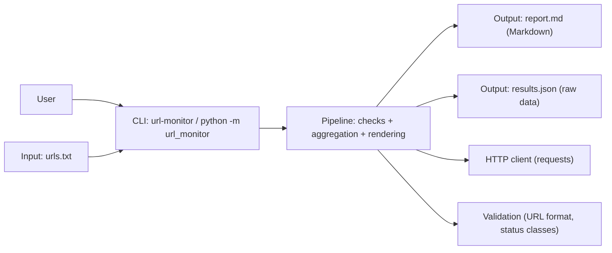

# URL Monitor

> English version is the canonical source: [README.md](README.md)

HTTP GET で URL のリストをチェックし、レイテンシ（latency）を測定して次を生成する Python CLI です。

- 人が読みやすい Markdown レポート（`report.md`）
- （任意）機械処理向け JSON アーティファクト（`results.json`）

このプロジェクトは再現可能（uv lockfile）で、CI フレンドリー（Ruff + pytest + GitHub Actions）になるよう設計しています。

テストはデフォルトでネットワーク隔離（network-isolated）されています（pytest-socket により socket をブロックし、requests-mock により HTTP をモック化）。
CLI は、あなたが所有している、またはテストが許可された実在のエンドポイントに対して実行できますが、連続的な監視（continuous monitoring）や負荷試験（load testing）ではなく、小規模なチェック用途を想定しています。

## プロジェクトの状態（Project status）

このリポジトリは **ポートフォリオ用のデモンストレーション**であり、積極的な開発は行いません。

- 機能追加は行いません（誤字修正などの小さな非機能的メンテナンスのみ）。
- サポートは提供しません（Issue/PR は対応しない場合があります）。
- CLI のインターフェースや、import できる関数は **best-effort** であり、予告なく変更される可能性があります。

## アーキテクチャ概要（Architecture overview）



## できること（What it does）

1行に1URLを含む入力ファイル（`urls.txt`）を与えると、URL Monitor は次を行います。

1. 入力行を検証（http/https + netloc 必須）
2. 設定可能な timeout を使って HTTP GET を送信
3. URL ごとの結果（status、latency、errors）を収集
4. サマリ指標を計算:
   - OK / FAIL 件数、error rate
   - ステータス分類の内訳（2xx/3xx/4xx/5xx/other）
   - **success** と **failure** サンプルそれぞれのレイテンシ統計（avg / 可能なら p95）
   - 遅いエンドポイント（top N）
   - HTTP failures（ステータスが OK ではない）と exceptions（例外）を分けてレポート
5. `report.md` を書き出し（任意で `results.json` も書き出し）

## クイックスタート（Quickstart）

### 責任ある利用（Responsible use）

このツールは、あなたが所有している、またはテストが許可されたエンドポイントに対する小規模なチェック用途を想定しています。
第三者サービスに対する負荷試験（load testing）や高頻度監視（high-frequency monitoring）には使用しないでください。
性能評価 / ストレステストには、モックまたは制御されたエンドポイントを使ってください（このリポのテストは外部ネットワークを必要としません）。

### 要件（Requirements）

- Python 3.13
- `uv` がインストールされていること

### 依存のインストール / 同期（Install / Sync dependencies）

```bash
uv sync --locked
```

### 入力の準備（Prepare input）

`urls.txt` を作成します。

```txt
https://example.com
https://example.org
https://example.net
```

### 実行（Markdown report）（Run (Markdown report)）

注: このリポは `git clone` + `uv sync --locked` で利用します。コンソールスクリプト（`uv run url-monitor ...`）として実行することも、モジュール実行（`uv run -- python -m url_monitor ...`）として実行することもできます。

デフォルトでは、レポートはカレントディレクトリに `report.md` として書き出されます。

```bash
# Console script
uv run url-monitor --input urls.txt --out report.md

# Same behavior via module execution
uv run -- python -m url_monitor --input urls.txt --out report.md
```

Tip: デフォルト値があるため、`urls.txt` と `report.md` を使う場合は `--input` や `--out` を省略できます。

```bash
uv run url-monitor
```

### 実行（成果物: report.md + results.json）（Run (Artifacts: report.md + results.json)）

`--out-dir` を使うと、`report.md` と `results.json` の両方をディレクトリに書き出します。  
（これらのオプションの正確な挙動とデフォルト値は `url-monitor --help` を参照してください。）

```bash
# Console script
uv run url-monitor --input urls.txt --out-dir out/

# Same behavior via module execution
uv run -- python -m url_monitor --input urls.txt --out-dir out/
```

出力（Outputs）:

- `out/report.md`
- `out/results.json`

### よく使うオプション（Common options）

- `--timeout <seconds>`: リクエストの timeout（デフォルト: 5.0）
- `--strict`: 入力に invalid URL が含まれていたら fail fast

## CLI オプション（CLI options）

```bash
uv run url-monitor --help
```

Common options:

- `--input PATH`: 入力ファイルパス（デフォルト: `urls.txt`）
- `--out PATH`: 出力 Markdown パス（デフォルト: `report.md`）
- `--out-dir DIR`: 出力ディレクトリ（`report.md` + `results.json` を書き出す）
- `--timeout SECONDS`: リクエスト timeout（デフォルト: `5.0`）
- `--strict`: invalid な入力行があれば fail fast

### 不正な入力に関する補足（Notes on invalid input）

- `--strict` を使うと、invalid 行は明確なエラーメッセージで即時に失敗します（fail fast）。
- `--strict` を使わない場合、invalid 行は収集され、レポートの “Invalid input lines” に表示されます。

## 出力成果物（Output artifacts）

### `report.md`（人間向け / human-readable）

レポートには次が含まれます。

- Summary（件数、error rate、サンプル数）
- Status breakdown
- Slowest URLs
- HTTP failures（OK ではないステータス）
- Exceptions（リクエストエラー）
- Invalid input lines（`--strict` を使わない場合）

これは、素早い切り分け（triage）や共有に向いています。

### `results.json`（機械向け / machine-readable、任意 / optional）

`--out-dir` を使ったときに書き出されます。

トップレベルのフィールド（Top-level fields）:

- `source`: 入力ファイル名 / パス
- `summary`: 集約された指標
- `results`: URL ごとのチェック結果リスト

これは、後段の分析（例: time-series 集約、dashboards）を想定しています。

## ライブラリ利用（best-effort API）（Library usage (best-effort API)）

このパッケージは再利用のための小さな **best-effort** Python API を公開しています。これはコード構成を示す目的で提供されており、**サポート対象外**かつ**安定性保証はありません**。

- `run_monitor(...)` はチェックを実行し、`(results, summary, report_md, invalids)` を返します
- `save_outputs(...)` は `report.md` と `results.json` をディレクトリに書き出します

Example:

```python
from pathlib import Path

from url_monitor import run_monitor, save_outputs

results, summary, report_md, invalids = run_monitor(
    Path("urls.txt"),
    timeout=5.0,
    strict=False,
)

save_outputs(
    results=results,
    summary=summary,
    report_md=report_md,
    source="urls.txt",
    out_dir=Path("out"),
)
```

## 開発（Development）

### Lint / Format

```bash
uv run ruff check .
uv run ruff format --check .
```

ローカルでフォーマット（Format locally）:

```bash
uv run ruff format .
```

### テスト（Test）

```bash
uv run pytest -q
```

### テストに関する補足（Notes on testing）

- ユニットテストはデフォルトで **オフライン**です: テストスイートは `--disable-socket`（pytest-socket 経由）で動くため、意図しない実ネットワーク I/O は即座に失敗します。
- HTTP の挙動は `requests_mock` pytest fixture（requests-mock）でテストするため、`requests.Session.get(...)` はインターネットに接続せずに検証できます。
- レイテンシのパーセンタイルは `time.perf_counter` を monkeypatch して決定的（deterministic）にテストします（不安定なタイミング依存を避けます）。

## プロジェクト構成（Project structure）

```text
url-monitor/
  README.md
  LICENSE
  pyproject.toml
  uv.lock
  src/
    url_monitor/
      __init__.py
      __main__.py
      cli.py
      pipeline.py
      outputs.py
      model.py
      validate.py
      io.py
      http.py
      stats.py
      report.py
  tests/
    test_http.py
    test_pipeline_p95_demo.py
    test_report.py
    test_smoke.py
    test_stats.py
    test_validate.py
  docs/
    github-ssh-runbook.md
  .github/
    workflows/
      ci.yml
```

## ロードマップ（Roadmap）

- [x] CI 安定化のための network-independent tests（HTTP モック）を追加
- [ ] 過去実行結果の永続化（SQLite / Parquet）
- [ ] rate limiting 付きの concurrency を追加
- [ ] retries/backoff を設定可能にする
- [ ] 統計レポートを拡充（分布プロット、トレンド分析）

## ドキュメント（Documentation）

- [GitHub SSH Runbook (macOS) 日本語訳版](docs/github-ssh-runbook.ja.md)

## ライセンス（License）

MIT License. `LICENSE` を参照してください。
