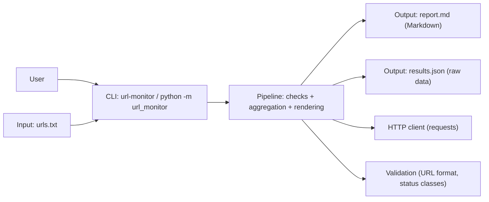

# URL Monitor

> 日本語版: [README.ja.md](README.ja.md)

A Python CLI that checks a list of URLs via HTTP GET, measures latency, and generates:

- a human-readable Markdown report (`report.md`)
- an optional machine-readable JSON artifact (`results.json`)

This project is designed to be reproducible (uv lockfile) and CI-friendly (Ruff + pytest + GitHub Actions).

Tests are network-isolated by default (socket blocked via pytest-socket; HTTP mocked via requests-mock).
The CLI can be run against real endpoints you own or are authorized to test, but it is intended for small-scale checks rather than continuous monitoring or load testing.

## Project status

This repository is a **portfolio demonstration** and is not under active development.

- No feature development is planned (only small, non-functional maintenance such as typo fixes).
- No support is provided (issues/PRs may be ignored).
- The CLI interface and any imported functions are **best-effort** and may change without notice.

## Architecture overview



## What it does

Given an input file (`urls.txt`) with one URL per line, URL Monitor will:

1. Validate input lines (http/https + netloc required)
2. Send HTTP GET requests with a configurable timeout
3. Collect per-URL results (status, latency, errors)
4. Compute summary metrics:
   - OK / FAIL counts, error rate
   - Status-class breakdown (2xx/3xx/4xx/5xx/other)
   - Latency stats for **success** and **failure** samples (avg / p95 when available)
   - Slowest endpoints (top N)
   - Separate reporting for HTTP failures vs exceptions
5. Write `report.md` (and optionally `results.json`)

## Quickstart

### Responsible use

This tool is intended for small-scale checks of endpoints you own or are authorized to test.
Do not use it for load testing or high-frequency monitoring against third-party services.
For performance/stress testing, use mocked or controlled endpoints (tests in this repo do not require external network).

### Requirements

- Python 3.13
- Recommended: `uv` (fast and reproducible via `uv.lock`)
- Alternative: `pip` (see below)

### Install / Sync dependencies (uv, recommended)

```bash
uv sync --locked
```

### Alternative install (pip)

If you don't use `uv`, you can install the project with `pip`.

```bash
python -m venv .venv
source .venv/bin/activate  # Windows: .venv\Scripts\activate
python -m pip install -U pip
pip install -e ".[dev]"
```

- To run only the CLI (no dev tools), use `pip install -e .` instead.

### Prepare input

Create `urls.txt`:

```txt
https://example.com
https://example.org
https://example.net
```

### Run (Markdown report)

Note: Use this repo via `git clone` + (`uv sync --locked` recommended; or the pip alternative above). You can run it either as a console script (`uv run url-monitor ...`) or via module execution (`uv run -- python -m url_monitor ...`).

By default, the report is written to `report.md` in the current directory.

```bash
# Console script
uv run url-monitor --input urls.txt --out report.md

# Same behavior via module execution
uv run -- python -m url_monitor --input urls.txt --out report.md
```

Tip: since defaults exist, you can omit `--input` and/or `--out` if you use `urls.txt` and `report.md`.

```bash
uv run url-monitor
```

### Run (Artifacts: report.md + results.json)

Use `--out-dir` to write both `report.md` and `results.json` into a directory.
(Note: for the authoritative semantics and defaults of these options, refer to `url-monitor --help`.)

```bash
# Console script
uv run url-monitor --input urls.txt --out-dir out/

# Same behavior via module execution
uv run -- python -m url_monitor --input urls.txt --out-dir out/
```

Outputs:

- `out/report.md`
- `out/results.json`

### Common options

- `--timeout <seconds>`: request timeout (default: 5.0)
- `--strict`: fail fast if the input contains invalid URLs

## CLI options

```bash
uv run url-monitor --help
```

Common options:

- `--input PATH`: input file path (default: `urls.txt`)
- `--out PATH`: output Markdown path (default: `report.md`)
- `--out-dir DIR`: output directory (writes `report.md` + `results.json`)
- `--timeout SECONDS`: request timeout (default: `5.0`)
- `--strict`: fail fast on invalid input lines

### Notes on invalid input

- With `--strict`, invalid lines fail fast with a clear error message.
- Without `--strict`, invalid lines are collected and displayed in the report under “Invalid input lines”.

## Output artifacts

### `report.md` (human-readable)

The report includes:

- Summary (counts, error rate, sample sizes)
- Status breakdown
- Slowest URLs
- HTTP failures (non-OK status)
- Exceptions (request errors)
- Invalid input lines (when `--strict` is not used)

This is intended for quick triage and sharing.

### `results.json` (machine-readable, optional)

Written when `--out-dir` is used.

Top-level fields:

- `source`: input file name/path
- `summary`: aggregated metrics
- `results`: list of per-URL check results

This is intended for downstream analysis (e.g., time-series aggregation, dashboards).

## Library usage (best-effort API)

This package exposes a small **best-effort** Python API for reuse. It is provided to demonstrate code structure; it is **not supported** and comes with **no stability guarantees**:

- `run_monitor(...)` runs checks and returns `(results, summary, report_md, invalids)`
- `save_outputs(...)` writes `report.md` and `results.json` into a directory

Example:

```python
from pathlib import Path

from url_monitor import run_monitor, save_outputs

results, summary, report_md, invalids = run_monitor(
    Path("urls.txt"),
    timeout=5.0,
    strict=False,
)

save_outputs(
    results=results,
    summary=summary,
    report_md=report_md,
    source="urls.txt",
    out_dir=Path("out"),
)
```

## Development

### Lint / Format

```bash
uv run ruff check .
uv run ruff format --check .
```

Format locally:

```bash
uv run ruff format .
```

### Test

```bash
uv run pytest -q
```

### Notes on testing

- Unit tests are **offline by default**: the test suite runs with `--disable-socket` (via pytest-socket), so any accidental real network I/O fails fast.
- HTTP behavior is tested with the `requests_mock` pytest fixture (requests-mock), so `requests.Session.get(...)` is exercised without talking to the internet.
- Latency percentiles are tested deterministically by monkeypatching `time.perf_counter` (no flaky timing).

## Project structure

```text
url-monitor/
  README.md
  LICENSE
  pyproject.toml
  uv.lock
  src/
    url_monitor/
      __init__.py
      __main__.py
      cli.py
      pipeline.py
      outputs.py
      model.py
      validate.py
      io.py
      http.py
      stats.py
      report.py
  tests/
    test_http.py
    test_pipeline_p95_demo.py
    test_report.py
    test_smoke.py
    test_stats.py
    test_validate.py
  docs/
    github-ssh-runbook.md
  .github/
    workflows/
      ci.yml
```

## Roadmap

- [x] Add network-independent tests (mocked HTTP) for CI stability
- [ ] Persist historical runs (SQLite / Parquet)
- [ ] Add concurrency with rate limiting
- [ ] Add configurable retries/backoff
- [ ] Add richer statistical reporting (distribution plots, trend analysis)

## Documentation

- [GitHub SSH Runbook (macOS)](docs/github-ssh-runbook.md)

## License

MIT License. See `LICENSE`.
